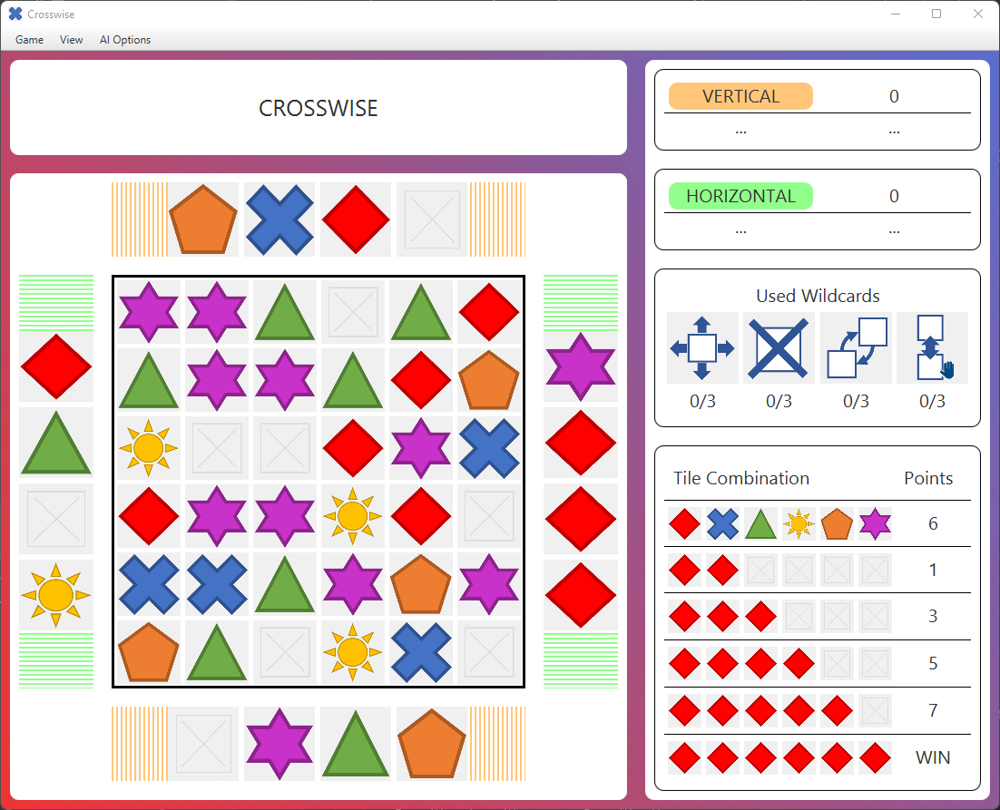

# README
Es handelt sich um ein Projekt im Rahmen des  Programmierpraktikums an der Fachhochschule Wedel. Folgendes Projekt ist die Implementierung des Brettspiels "Crosswise" in **Java** mit einer grafischen Oberfläche mit **JavaFX**.

(Für weitere Informationen und Implementierungsdetails, siehe **Dokumentation**)

# Crosswise

Crosswise ist ein Brettspiel, welches durch strategischen Platzieren von Spielsteinen auf einem
Spielbrett gespielt wird. Ziel ist es, durch Kombinationen von Spielsteinen in Zeilen bzw. Spalten die
meisten Punkte zu erzielen. Dabei müssen die Spieler in alle Richtungen schauen, denn jeder Spielzug
wirkt sich auf die Punktzahl des eigenen Teams, aber auch auf die des gegnerischen Teams aus.
Gespielt wird mit 2 oder 4 Spielern, wobei die Spieler eines Teams immer gegenüber voneinander
sitzen und Punkte in ihren Spalten sammeln müssen.

# Auführung
Navigiere ins Verzeichnis mit der Executable:
- `Crosswise/tags/final-binaries`

Führe folgenden Befehl im Terminal aus:
- `java -jar pp_Crosswise_Jusup-1.0-SNAPSHOT.jar`
